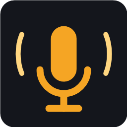

<p align="center">
  
</p>

<h1 align="center">Wardogs Radio</h1>

<p align="center">Play music over your mic in Wardogs. Pick an app, hit Start, done.</p>

---

## Get it

1. Download **WardogsRadio.exe** from the [latest release](../../releases/latest).
2. Double-click it. That's the whole install.

> Windows may show *"Windows protected your PC"* the first time, because the exe isn't code-signed.
> Click **More info → Run anyway**.

## Use it

The first time you open it, it sets up a virtual microphone (takes about a minute, only happens once). Windows will ask for permission along the way. Click **Yes** / **Install** when it does.

After that, every time:

1. **Your microphone** – pick your headset mic (it usually picks the right one already).
2. **What plays on the radio** – click the app you want people to hear. Spotify, YouTube in Chrome, whatever. It keeps playing in your own headset like normal.
3. **In Wardogs**, set your microphone to **Wardogs Radio**.
4. Hit **START RADIO**.

Leave your mic open in the game. Everyone hears you *and* the music. Use the two sliders to balance your voice against the music.

Wardogs Radio remembers your choices. Next time you open it, it starts by itself as soon as your music app is running.

## How it works

```
your mic ────┐
             ├─ mix ─► "Wardogs Radio" virtual microphone ─► the game
music app ───┘
```

- The music app's audio is tapped with the same Windows feature Discord uses for "share app audio" (per-process loopback capture). Nothing is rerouted; you still hear it normally.
- Your mic and the music are mixed, softly limited so it never clips, and played into a virtual audio cable.
- The other end of that cable shows up in Windows as a microphone called **Wardogs Radio**. Pick it in the game and you're on air.

The virtual cable is [VB-CABLE](https://vb-audio.com/Cable/) by VB-Audio. It's donationware; if this tool is useful to you, throw them a few bucks. Wardogs Radio downloads the official package from vb-audio.com on first run and runs their installer in front of you. It also puts your default speakers and mic back the way they were, because VB-CABLE's installer likes to make itself the default.

## Requirements

- Windows 10 (May 2020 update, build 19041) or Windows 11, 64-bit.
- A microphone.

## Building

```
dotnet publish src/WardogsRadio/WardogsRadio.csproj -c Release -o publish
```

Needs the .NET 10 SDK. Output is a single self-contained `publish/WardogsRadio.exe`.

Pushing a tag like `v1.2.0` makes GitHub Actions build the exe and attach it to a release automatically.

## Project layout

| Path | What |
|---|---|
| `Audio/RadioEngine.cs` | The mixer: mic + app → cable |
| `Audio/ProcessLoopbackCapture.cs` | Per-process audio capture (WASAPI process loopback) |
| `Audio/AudioApps.cs` | Finds apps that have audio sessions, with icons |
| `Audio/AudioDevices.cs` | Lists mics, finds the cable |
| `Setup/VbCableInstaller.cs` | First-run setup: download, elevated install, rename to "Wardogs Radio", restore defaults |
| `Interop/` | Small COM shims for renaming endpoints and setting default devices |
| `ViewModels/MainViewModel.cs` | All UI state and behaviour |
| `MainWindow.xaml`, `Themes/Dark.xaml` | The UI |

## License

MIT. See [LICENSE](LICENSE). VB-CABLE is separately licensed by VB-Audio Software.
