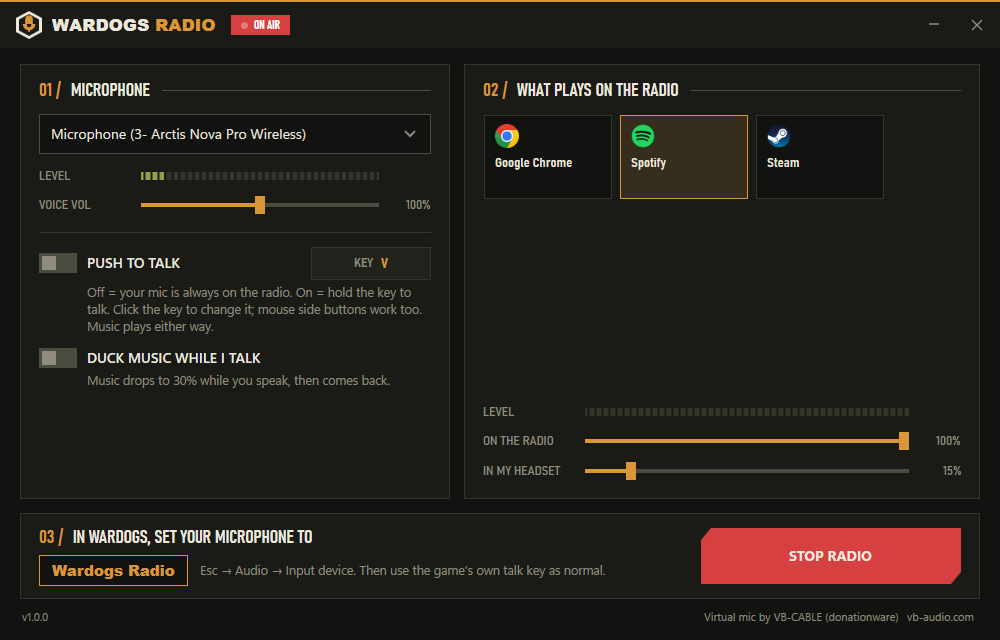

<p align="center">
  
</p>

<h1 align="center">WARDOGS RADIO</h1>

<p align="center">Play music through your mic in WARDOGS. Pick an app, hit Start, done.<br>
Free, open source, no installer.</p>

<p align="center">
  <a href="../../releases/latest"><b>⬇ Download WardogsRadio.exe</b></a>
</p>

<p align="center">
  
</p>

---

## Get it running

1. Download **WardogsRadio.exe** from the [latest release](../../releases/latest) and double-click it. That's the install.
2. First time only: it sets up a virtual microphone. Click **Set it up**, then **Yes** / **Install** when Windows asks. Takes about a minute.
3. Every time after that:
   - **01 / Microphone** – your headset mic. It usually picks the right one already.
   - **02 / What plays on the radio** – click the app. Spotify, YouTube in a browser, whatever. It keeps playing in your own headset like normal.
   - **03 / In WARDOGS** – press Esc → Audio → Input device → pick **Wardogs Radio**. One time.
   - Hit **START RADIO**.

Then fly. Use the game's normal talk key. Everyone in range hears you *and* the music.

> Windows may show *"Windows protected your PC"* the first time because the exe isn't code-signed. Click **More info → Run anyway**.

## What the controls do

| Control | What it does |
|---|---|
| **Voice vol** | How loud you are on the radio. |
| **On the radio** | How loud the music is for everyone else. |
| **In my headset** | How loud the music is for *you*. Doesn't change what others hear. |
| **Push to talk** | Off = your mic is always on the radio. On = hold the key to talk. Click the key to rebind it; keyboard keys and mouse side buttons both work. The music plays either way. |
| **Duck music while I talk** | Music dips to 30% while you speak and comes back when you stop. |

Wardogs Radio remembers your choices. Next time you open it, it starts by itself as soon as your music app is running.

## Is this safe with the anti-cheat?

Wardogs Radio never touches the game. It does not open the game process, inject anything, hook anything, read memory, or draw over the game. From the game's point of view it is just another microphone in the Windows device list, exactly like a headset or NVIDIA Broadcast.

Specifically:

- Music is captured from the app you pick (e.g. Spotify) using Windows' own per-app audio capture, the same thing Discord uses for "share app audio". The game's audio is never captured.
- The push-to-talk key is read the same way any regular app checks whether a key is held. No keyboard hooks.
- The virtual microphone is VB-CABLE, a standard signed Windows audio driver used by countless streaming and voice setups.

Nothing here is a cheat, overlay, or mod. That said, this project has no relationship with BULKHEAD or Team17 and can't speak for their anti-cheat policy. Use your own judgement.

## How it works

```
your mic ────┐
             ├─ mix ─► "Wardogs Radio" virtual microphone ─► the game
music app ───┘
```

- The music app's audio is tapped with per-process loopback capture (Windows 10 2004+). Nothing is rerouted; you still hear it normally.
- Your mic and the music are mixed, soft-limited so it never clips, and played into a virtual audio cable.
- The other end of that cable is a Windows microphone named **Wardogs Radio**. Pick it in the game and you're on air.

The virtual cable is [VB-CABLE](https://vb-audio.com/Cable/) by VB-Audio. It's donationware; if this tool is useful to you, throw them a few bucks. Wardogs Radio downloads the official package from vb-audio.com on first run and runs their installer in front of you. It then puts your default speakers and mic back the way they were, because VB-CABLE's installer makes itself the default.

## Requirements

- Windows 10 (May 2020 update, build 19041) or Windows 11, 64-bit.
- A microphone.

## Building it yourself

```
dotnet publish src/WardogsRadio/WardogsRadio.csproj -c Release -o publish
```

Needs the [.NET 10 SDK](https://dotnet.microsoft.com/download). Output is a single self-contained `publish/WardogsRadio.exe`.

### Releases

GitHub Actions builds the exe on every push. To publish a release:

```
git tag v1.0.0
git push --tags
```

The workflow builds `WardogsRadio.exe`, creates the GitHub release, attaches the exe, and writes the release notes.

## Project layout

| Path | What |
|---|---|
| `Audio/RadioEngine.cs` | The mixer: mic + app → cable, push-to-talk gate, ducking, limiter |
| `Audio/ProcessLoopbackCapture.cs` | Per-process audio capture (WASAPI process loopback) |
| `Audio/AudioApps.cs` | Finds apps that have audio sessions, with icons; sets their mixer volume |
| `Audio/AudioDevices.cs` | Lists mics, finds the cable |
| `Setup/VbCableInstaller.cs` | First-run setup: download, elevated install, rename to "Wardogs Radio", restore defaults |
| `Interop/` | Small COM shims: rename endpoints, set default devices, key state |
| `ViewModels/MainViewModel.cs` | All UI state and behaviour |
| `MainWindow.xaml`, `Themes/Dark.xaml` | The UI |

## License

MIT. See [LICENSE](LICENSE). VB-CABLE is separately licensed by VB-Audio Software. WARDOGS is a trademark of its owners; this is an unofficial fan tool.
